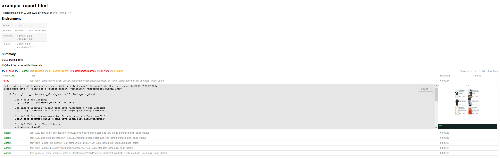

## Overview
For my first QA automation project, I built a test automation framework using the practice website Sauce Demo(https://www.saucedemo.com/). Applying what I've learned from Udemy courses, I structured the framework following the Page Object Model (POM) design pattern. The framework supports multiple browsers, generates detailed HTML reports, logging, and automatically captures screenshots upon test failures.

## Created With
| Name | Version |
| --- | --- |
| [Python](https://www.python.org/) | 3.12.4 |
| [Pytest](https://pypi.org/project/pytest/) | 8.3.3 |
| [Pytest-html]( https://pypi.org/project/pytest-html/) | 4.1.1 |
| [Selenium](https://pypi.org/project/selenium/) | 4.24.0 |
## Walkthrough
[](https://drive.google.com/file/d/1Q3soSmEk7vSJ1OlhLwU3In3mxGzJTMmL/view?usp=drive_link)
## Usage
> [!Note]
> All commands are ran within the `tests` folder/directory.

To run all test in the test suite from the command prompt (cmd) with the following command:
```
pytest
```
To run a specific test from the test suite:
```
pytest test_login_standard_user.py
```
To generate a html report `--html [where to generate report]` needs to be included in the command, example:
```
pytest test_login_standard_user.py  --html ../reports/report.html
```
Chrome is the default browser to specify which browser to run the tests on `—browser_name [chrome/firefox/ie]` needs to be included in the command, example:
```
pytest test_login_standard_user.py  --html ../reports/report.html --browser_name firefox
```

## Example Report

